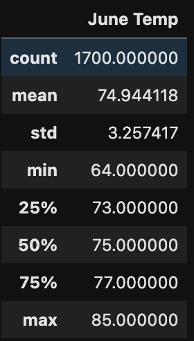
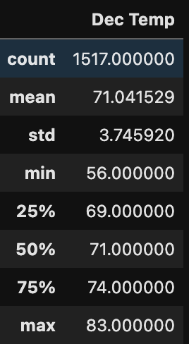

# Surfs Up Challenge

## Overview of Analysis
* 
 The purpose of this analysis was to get descriptive statistics tempatures in Hawaii for a surf and ice cream shop 

## Results

* 
 Here we can see that in June and December, there aren't huge differences in tempature. 

* 
 However, we can see that in June and Dec there is a significant difference in the quartiles. So while the means are similar the day to day weather does appear to be colder in December. 

* 
 Additionally, the STD of Dec is higher than in June, so that means there is greater variability in the weather. 

## Summary

*
 June is warmer than December but not by much. It should not affect business as much as say. More insteresting data would probably be the tourism. 
